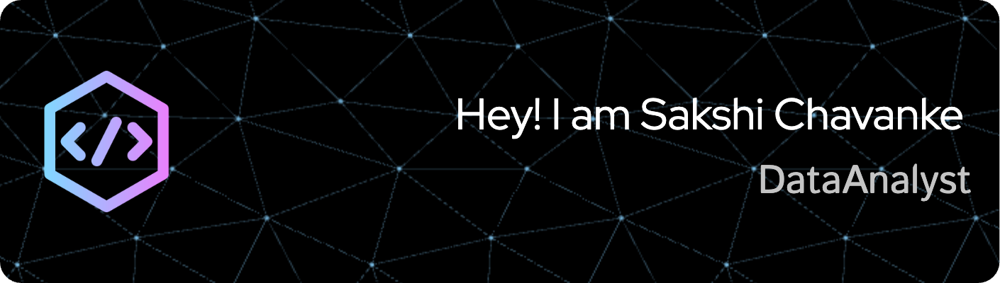

# Welcome to My Awesome Profile! 🚀

##  👋 Hey there, fellow data explorer! 🚀

Welcome to my GitHub wonderland, Thanks for dropping by.

## About Me

I'm Sakshi Chavanke, a curious data enthusiast with a passion for unraveling insights and driving strategic decision-making. With a background in Engineering Management and a specialization in Data Science, I'm on a mission to unravel the mysteries hidden within datasets and create magic in the realm of data.

## 💻 Data Tool Kit

- Data Analysis: SQL, Python (Pandas, NumPy).
- Visualization: Tableau, Power BI, Matplotlib, Plotly.
- Machine Learning: Scikit-learn, TensorFlow, Keras.
- Business Intelligence: Excel (PivotTables, VLOOKUP), Google Analytics.
- Process Improvement: Lean Six Sigma, Business Process Mapping.
- And many more tools and techniques waiting to be explored!

## 🚀 What I'm Up To

I'm always on the lookout for thrilling data challenges to fuel my passion. Currently, I'm:
- 🔄  Crafting captivating visualizations to tell compelling data stories.
- 🤖 Delving into the captivating world of machine learning and predictive analytics.

- 📈 Analyzing market trends and customer behavior to identify growth opportunities.
- 📊 Creating insightful dashboards and reports to communicate key business metrics.
- 🔍 Exploring innovative ways to leverage data for business insights and decision-making.

## 🏆 Achievements

- 🥇 Developed a data-driven dashboard that revolutionized decision-making processes for a startup.
- 🏅 Implemented a data-driven pricing strategy that boosted revenue by 25% within six months.
- 📝 Led a cross-functional team in optimizing supply chain operations, resulting in reduction in lead times and a 15% increase in cost savings.

## 🔮 What I'm Looking For

I'm eager to collaborate with fellow data enthusiasts on exciting projects that challenge and inspire us. Whether it's exploring new datasets, analyzing customer segmentation, brainstorming predictive models or sharing hilarious data memes, count me in!

## 🤝 Let's Connect

I believe in the power of collaboration and meaningful discussions. Feel free to reach out if you'd like to:
- 📈 Chat about all things data over a virtual coffee (or your beverage of choice!).
- 🌐 Collaborate on fascinating data projects that push the boundaries of possibility.
- 💡 Discuss the latest trends in data science and brainstorm innovative solutions to real-world problems.
- 🎮 Form a data analysis squad and tackle Kaggle competitions together - let's aim for the top spot!

## 🎉 Let's Create Something Awesome Together!

Thanks for taking the time to explore my GitHub profile and learn a bit about me. If you're as passionate about data as I am, let's embark on this thrilling journey together! Hit that "Follow" button and let's unleash the power of data! 💫
May your code run swiftly and your insights shine brightly! Happy data exploration! 🚀🔍

"Where there's data, there's discovery!"

Let's keep exploring, analyzing, and innovating! 😊

